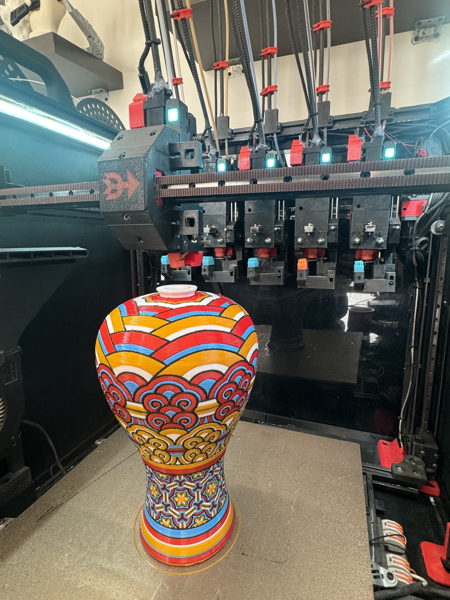

# DAKSH V2 3D Printed Tool Changer - BETA 1

DAKSH V2 3D Printed Tool Changer is a fully 3D printed mechanical tool changer compatible with different CoreXY platforms like the Voron Trident, 1.8, 2.4  and RatRig VCore 3. The servo less mechanical locking mechanism is inspired by the Prusa XL - but is fully 3d printed with metal inserts in the critical areas for rigidity and reliability.

Salient Features: 

  * Fully Mechanical Tool Changer
  * Ultra Fast tool changing time of under 4 seconds
  * Fully 3d Printed and assembled using off the shelf components - no machined parts required
  * Intelligent Error State Detection and Recovery minimizing failed prints
  * Intelligent Tool Heating Management for faster and efficient prints
  * Automatic XYZ calibration across the different tools
  * Capable of High accelerations and print speeds
  * Minimal loss in build space with the tool changer addition
  * Integrated nozzle ooze blockers for clean prints with minimal waste
  * Status LEDs on each toolhead for accurate visual state diagnosis
  * Custom Klipper configuration, modules and macros for an integrated software package
  * Stiff Wire Looms and recoil management - wire looms are entirely contained within the printer frame itself.
  * Fully Enclosed Design in the same design ethos as the original Voron Trident design - giving it the ability to print high temp materials like ABS, PA6-CF and PC-CF etc which require enclosed chambers.

The design is open source and can be used freely for non commercial purposes. 

Do join the discord group at the link below and subscribe to the Youtube channel for more updates and interesting projects like this.

* Github - https://github.com/ankurv2k6/wp-daksh-toolchanger-v2
* Youtube - https://www.youtube.com/channel/UCr8K1tva2CaEhyqNyaEjq_w
* Daksh V2 Discord - https://discord.gg/Kz9VC8rWPg
* BOM - https://docs.google.com/spreadsheets/d/1QoVVL631YvgMzufe0YYzEZLL2HR7eI9XxlXjXiLeulk/edit#gid=0

#TinkerCAD 3D Model
https://www.tinkercad.com/things/gGSLXbT6uc8-daksh-v2-full-design-alpha-2-shared

Build Log and Demo videos 
* COMING SOON....

Sample Prints
* TimeLapse 

* Images

** 5 Colour PLA Print - 0.6mm Nozzle / 0.25 Layer Height / 23 Hours / 2000 Tool Changes **

  

** 5 Colour PLA Print - 0.6mm Nozzle / 0.25 Layer Height / 23 Hours / 2000 Tool Changes **

Build Images
* COMING SOON....

Attributions - This project uses elements from a bunch of different projects by awesome people out there - I will be including a list of credits soon. My apologies for not doing that at the very onset due to paucity of time.

* Quad Belted Z in based on the excellent work by genevamotion & thiagolocatelli - https://github.com/3DPrintingMods/VoronTrident-BeltedZ
